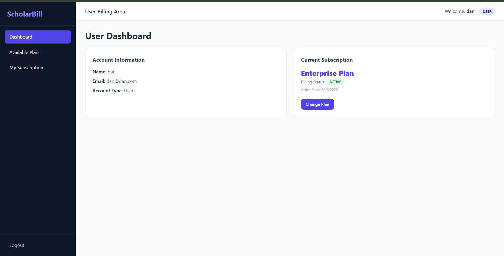
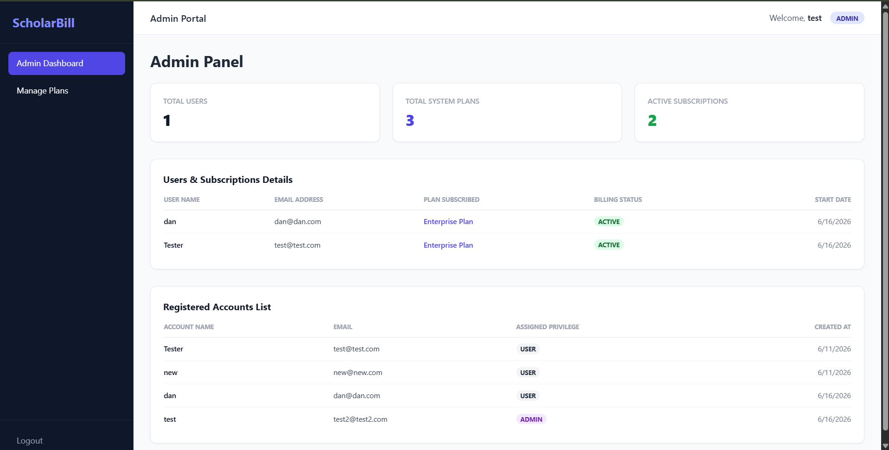

# ScholarBill - Role-Based SaaS Billing Portal

A full-stack SaaS Billing Portal built using the MERN Stack (MongoDB, Express.js, React.js, and Node.js). The platform enables users to manage subscription plans while providing administrators with tools to oversee users, subscriptions, and billing-related operations.

The application demonstrates role-based authentication, subscription management, protected routes, and modern dashboard functionality commonly found in SaaS products.

---

## Features

### Authentication & Authorization
- User Registration
- User Login
- JWT Authentication
- Password Hashing with bcryptjs
- Protected Routes
- Role-Based Access Control (Admin/User)

### User Features
- View Available Subscription Plans
- Subscribe to Plans
- View Current Subscription
- Manage Subscription Status
- Personalized Dashboard

### Admin Features
- View All Users
- Manage Subscription Plans
- View Active Subscriptions
- Dashboard Statistics
- User Management

### Subscription Management
- Free Plan (₹0/month)
- Pro Plan (₹299/month)
- Enterprise Plan (₹999/month)
- Plan Upgrades and Changes
- Subscription Tracking

### Dashboard Analytics
- Total Users
- Total Plans
- Active Subscriptions
- Subscription Overview

---

## Tech Stack

### Frontend
- React.js
- Vite
- Tailwind CSS
- React Router DOM
- Axios

### Backend
- Node.js
- Express.js
- MongoDB Atlas
- Mongoose
- JWT Authentication
- bcryptjs

### Deployment
- Vercel (Frontend)
- Render (Backend)
- MongoDB Atlas (Database)

---

## Screenshots

### User Dashboard



### Admin Dashboard



---

## Installation

### Clone Repository

```bash
git clone https://github.com/rexter001/ScholarBill.git
cd ScholarBill
```

### Backend Setup

```bash
cd server
npm install
npm start
```

### Frontend Setup

```bash
cd client
npm install
npm run dev
```

---

## Environment Variables

Create a `.env` file inside the server directory:

```env
PORT=5000
MONGO_URI=your_mongodb_atlas_connection_string
JWT_SECRET=your_jwt_secret
```

---

## Project Structure

```text
ScholarBill
│
├── client
│   ├── src
│   ├── package.json
│   └── vite.config.js
│
├── server
│   ├── controllers
│   ├── middleware
│   ├── models
│   ├── routes
│   ├── config
│   └── server.js
│
├── Screenshots
│   ├── User-Dashboard.png
│   └── Admin-Dashboard.png
│
├── .env.example
├── .gitignore
└── README.md
```

---

## Future Enhancements

- Payment Gateway Integration (Stripe/Razorpay)
- Invoice Generation
- Revenue Analytics Dashboard
- Email Notifications
- Subscription Renewal Reminders
- Export Reports
- Advanced Role Management
- Multi-Tenant SaaS Support

---

## Live Demo

Frontend: http://scholar-bill.vercel.app

Backend: https://scholarbill.onrender.com

---

## Author

**Khaja Mastan Shaik**

GitHub: https://github.com/rexter001
